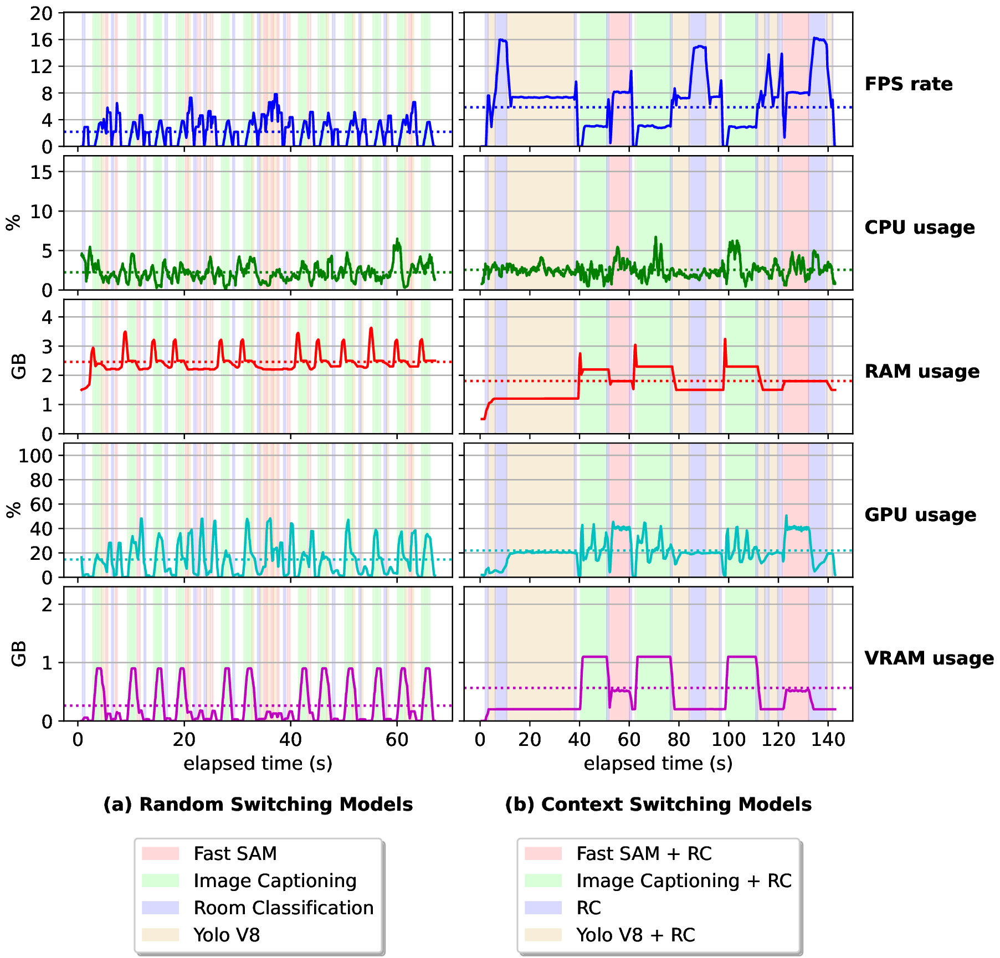

# AIMSM: Artificial Intelligence Model Switching Mechanism

## About the paper

### Summary

This work introduces the Artificial Intelligence Models Switching Mechanism (AIMSM), which enhances adaptability in preexisting AI systems by activating and deactivating AI models during runtime. AIMSM optimizes resource consumption by allocating only the necessary models for each situation, making it especially useful in dynamic environments with multiple AI models.

## Installation

### Install packages

```bash
# CREATE CONDA ENVIRONMENT
conda create -n aimsm python=3.10

# ROS INSTALLATION
sudo sh -c 'echo "deb http://packages.ros.org/ros/ubuntu $(lsb_release -sc) main" > /etc/apt/sources.list.d/ros-latest.list'
sudo apt install curl # if you haven't already installed curl
curl -s https://raw.githubusercontent.com/ros/rosdistro/master/ros.asc | sudo apt-key add -sudo apt updatesudo apt update
sudo apt update
sudo apt install ros-melodic-desktop-full
echo "source /opt/ros/melodic/setup.bash" >> ~/.bashrc
source ~/.bashrc

# ROS DEPENDENCIES
sudo apt-get install ros-melodic-rosbridge-suite
sudo apt-get install ros-melodic-slam-gmapping

# ROS PYTHON PACKAGES
pip install --upgrade pip
pip install rospkg pyyaml

# AIMSM DEPENDENCIES
git submodule update --recursive --remote --init
pip install -r requirements.txt
pip install -r fastsam/requirements.txt
```

### Download models

1. Download FastSAM model and place it in `weights` folder
   - [link](https://drive.google.com/file/d/1m1sjY4ihXBU1fZXdQ-Xdj-mDltW-2Rqv/view?usp=sharing)

## Robot@VirtualHome simulation

To correctly run and configure the Unity simulation, please follow the instructions provided at: [https://github.com/DavidFernandezChaves/RobotAtVirtualHome](https://github.com/DavidFernandezChaves/RobotAtVirtualHome)

## Run application

### Terminal 1: Instantiate the ROSBridge server

This will enable communication between the ROS environment and the PySide2 app.

```bash
source /opt/ros/melodic/setup.bash
conda activate melodic
roslaunch rosbridge_server rosbridge_websocket.launch
```

---

### (OPT) Terminal 2: Start up the RViz

This will enable you to visualize the robot's movements and sensors in the simulation using the RViz tool.

**Note: It must be at the root of the project before run the following code:**

```bash
source /opt/ros/melodic/setup.bash
rviz -d rviz/robot_at_virtualhome.rviz
```

OBS: must be at the root of the project

---

### (OPT) Terminal 3: Run the GMapping node

This will collect sensor data from the robot and generate a map of the environment.

```bash
source /opt/ros/melodic/setup.bash
rosrun gmapping slam_gmapping scan:=/RobotAtVirtualHome/scan
```

---

### Terminal 4: Run PySide2 app

This will start the PySide2 app and connect to the ROSBridge server.

```bash
conda activate aimsm
./run_linux.sh
```

## Run Experiments

### Run all models experiment

The following script will execute the "All Models" experiment and save the results in `labs/all_models_experiment.csv`.

```bash
cd experiments
python all_models_experiment.py
```

### Run single model experiment without AIMSM

The following script will execute the "Single Model - without AIMSM" experiment and save the results in `labs/single_model_without_AIMSM.csv`.

```bash
cd experiments
python single_model_without_AIMSM.py
```

### Run single model experiment with AIMSM

The following script will execute the "Single Model - with AIMSM" experiment and save the results in `labs/single_model_with_AIMSM.csv`.

```bash
cd experiments
python single_model_with_AIMSM.py
```

### Run random switching model experiment

The following script will execute the "Random Switching Models" experiment and save the results in `labs/random_switch_models_experiment.csv`.

```bash
cd experiments
python random_switch_models_experiment.py
```

### Run context switching model experiment

The following script will execute the "Context Switching Models" experiment and save the results in `labs/context_switching_experiment.csv`.

**Note: This experiment requires the Unity simulation to be running.**

```bash
cd experiments
python context_switching_experiment.py
```

## Visualization

### Experiments 1 and 2

The following script will execute the visualization of the experiments "All Models" and "Single Model" (with and without AIMSM).

```bash
cd labs
python plot_data_tripled.py
```


### Experiments 3 and 4

The following script will execute the visualization of the experiments "Random Switching Models" and "Context Switching Models".

```bash
cd labs
python plot_data_doubled.py
```


