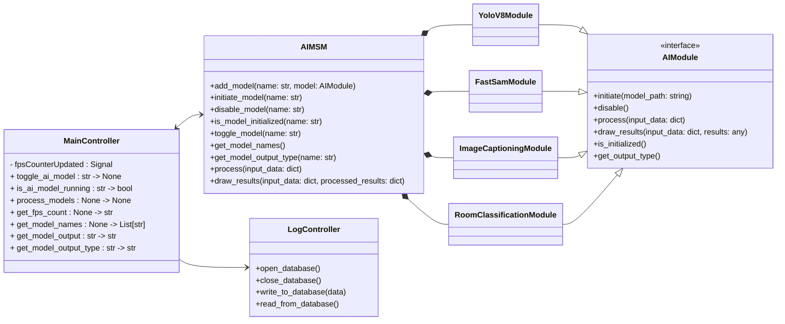

```mermaid
classDiagram
  direction LR
  MainController <--> AIMSM
  AIMSM *-- FastSamModule
  AIMSM *-- ImageCaptioningModule
  AIMSM *-- RoomClassificationModule
  AIMSM *-- YoloV8Module
  YoloV8Module --|> AIModule
  FastSamModule --|> AIModule
  ImageCaptioningModule --|> AIModule
  RoomClassificationModule --|> AIModule
  MainController --> LogController


  class LogController {
      +open_database()
      +close_database()
      +write_to_database(data)
      +read_from_database()
  }


  class MainController {
    - fpsCounterUpdated : Signal
    + toggle_ai_model : str -> None
    + is_ai_model_running : str -> bool
    + process_models : None -> None
    + get_fps_count : None -> str
    + get_model_names : None -> List[str]
    + get_model_output : str -> str
    + get_model_output_type : str -> str
  }

  class AIMSM {
    +add_model(name: str, model: AIModule)
    +initiate_model(name: str)
    +disable_model(name: str)
    +is_model_initialized(name: str)
    +toggle_model(name: str)
    +get_model_names()
    +get_model_output_type(name: str)
    +process(input_data: dict)
    +draw_results(input_data: dict, processed_results: dict)
  }

  class AIModule {
    <<interface>>
    +initiate(model_path: string)
    +disable()
    +process(input_data: dict)
    +draw_results(input_data: dict, results: any)
    +is_initialized()
    +get_output_type()
  }

  class FastSamModule { }
  class ImageCaptioningModule { }
  class RoomClassificationModule { }
  class YoloV8Module { }
```
