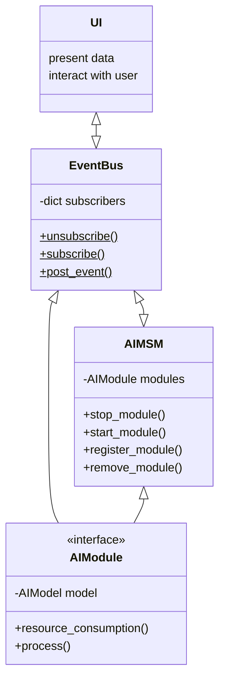

```mermaid
classDiagram
  EventBus <|-- AIModule
  UI <|--|> EventBus
  EventBus <|--|> AIMSM
  AIMSM <|-- AIModule

  class AIMSM {
    -AIModule modules
    +stop_module()
    +start_module()
    +register_module()
    +remove_module()
  }
  class EventBus {
    -dict subscribers
    +unsubscribe() $
    +subscribe() $
    +post_event() $
  }
  class UI {
      present data
      interact with user
  }
  class AIModule {
      <<interface>>
      -AIModel model
      +resource_consumption()
      +process()
  }
```
