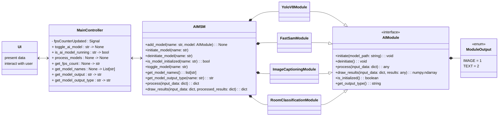

```mermaid
classDiagram
  direction LR
  UI <--> MainController
  MainController <--> AIMSM
  AIMSM *-- FastSamModule
  AIMSM *-- ImageCaptioningModule
  AIMSM *-- RoomClassificationModule 
  AIMSM *-- YoloV8Module 
  YoloV8Module --|> AIModule
  FastSamModule --|> AIModule
  ImageCaptioningModule --|> AIModule
  RoomClassificationModule --|> AIModule
  AIModule *-- ModuleOutput

  class MainController {
    - fpsCounterUpdated : Signal
    + toggle_ai_model : str -> None
    + is_ai_model_running : str -> bool
    + process_models : None -> None
    + get_fps_count : None -> str
    + get_model_names : None -> List[str]
    + get_model_output : str -> str
    + get_model_output_type : str -> str
  }

  class AIMSM {
    +add_model(name: str, model: AIModule): None
    +initiate_model(name: str)
    +deinitiate_model(name: str)
    +is_model_initialized(name: str): bool
    +toggle_model(name: str)
    +get_model_names(): list[str]
    +get_model_output_type(name: str): str
    +process(input_data: dict): dict
    +draw_results(input_data: dict, processed_results: dict): dict
  }

  class AIModule {
    <<interface>>
    +initiate(model_path: string): void
    +deinitiate(): void
    +process(input_data: dict): any
    +draw_results(input_data: dict, results: any): numpy.ndarray
    +is_initialized(): boolean
    +get_output_type(): string
  }
    
  class FastSamModule { }
  class ImageCaptioningModule { }
  class RoomClassificationModule { }
  class YoloV8Module { }

  class ModuleOutput {
    <<enum>>
    IMAGE = 1
    TEXT = 2
  }

  class UI {
      present data
      interact with user
  }
```
